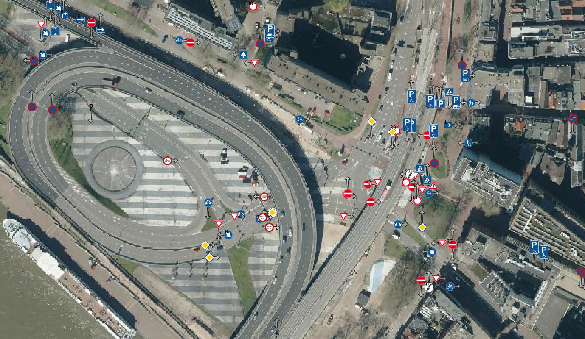

# Download en visualiseer verkeersborden in enkele minuten

Het NDW heeft een uitgebreide dataset met meer dan 1,9 miljoen verkeersborden in Nederland. Deze handleiding helpt u om 155 RVV-verkeersborden op de kaart te zetten met behulp van het open-source GIS-programma QGIS (https://qgis.org/).

## 1. Download de verkeersborden 

Bent u wegbeheerder en heeft u een George-account? Zodra u bent ingelogd, kunt u de verkeersborden downloaden via de knop 'Download' rechtsboven op <https://wegkenmerken.ndw.nu/verkeersborden>. Kies bij het downloaden de optie JSON. Heeft u nog geen account? Vraag er een aan via [mail@servicedeskndw.nu](mailto:mail@servicedeskndw.nu), onder vermelding van "Aanvraag George toegang".
Sla het gedownloade bestand op in een nieuwe map, bijvoorbeeld genaamd *NDW_verkeersborden*.

**Let op:** Bent u geen wegbeheerder? Dan kunt u de verkeersbordendata voor heel Nederland downloaden via de bovenstaande link (bestandsgrootte > 1 GB).
Wilt u een specifieke gemeente downloaden? Gebruik dan een URL zoals:
 [https://data.ndw.nu/api/rest/static-road-data/traffic-signs/v4/current-state?countyCode=GM0096](https://data.ndw.nu/api/rest/static-road-data/traffic-signs/v4/current-state?countyCode=GM0096).
 Vervang de *countyCode* door een andere CBS-gemeentecode. U kunt de juiste gemeentecode vinden via deze [CBS-pagina](<https://www.cbs.nl/nl-nl/onze-diensten/methoden/classificaties/overig/gemeentelijke-indelingen-per-jaar/indeling-per-jaar/gemeentelijke-indeling-op-1-januari-2024>).

Zie ook [interface documentatie van de API](https://docs.ndw.nu/data-uitwisseling/interface-beschrijvingen/verkeersborden-api/)

## 2. Download de opmaakstijl
Sla het volgende bestand lokaal op: [verkeersborden_visualisatie_url.qml](verkeersborden_visualisatie_url.qml).

## 3. Maak de kaart
1. Open QGIS.
2. Ga naar **Kaartlagen** > **Laag toevoegen**> **Vectorlaag toevoegen**
3. Kies als bron **Bestand**. Klik op het knopje met de drie puntjes.
4. Navigeer naar het eerder gedownloade verkeersbordenbestand (standaardnaam: *verkeersborden_actueel_beeld.json*). Er verschijnen punten op de kaart.
5. Als deze buiten het kaartbeeld vallen, zoom dan naar de laag.
6. Klik met de rechtermuisknop op de laag *verkeersborden_actueel_beeld*. Selecteer **Eigenschappen**.
7. Kies in het linker paneel voor de optie **Symbologie**.
8. Klik onderaan op **Stijl** en kies dan voor **Stijl laden** > **Uit bestand**. Klik op het knopje met de drie puntjes en navigeer naar het bestand *verkeersborden_visualisatie_url.qml* en laad de stijl.
9. Klik op **Toepassen** en daarna op **OK**.
10. De verkeersborden worden op de kaart weergegeven, bekijk het resultaat.

Wilt u meer weten over George en hoe u de dataset van NDW kunt aanvullen of updaten?
Bezoek [NDW George applicaties](https://www.ndw.nu/ndw/applicaties/george).

NB Verkeersborden die op hetzelfde locatie liggen of zeer vlak bij elkaar worden over elkaar heen geprojecteerd. Dit is een aandachtspunt bij het gebruik van de style.

De plaatjes van de verkeersborden worden telkens gedownload van de NDW server. U kunt de icoontjes ook als [ZIP-file](https://github.com/ndwnu/qgis-verkeersborden-style/verkeersborden_svg.zip) downloaden naar uw computer.
Onder symbologie onder 'SVG Marker' helemaal onderaan bij de witte balk moet u dan de verwijzing naar de NDW server vervangen naar een lokale map.

## 5. Dankwoord en doorontwikkeling
De basis van deze style is geleged op de [FOSS4G BE+NL 2024](https://foss4g.be/nl/programme.php) tijdens de codesprint op vrijdag waar aanwezigen hebben geholpen bij het maken van de code.
Heeft u verbeteringen, pull request zijn welkom.
